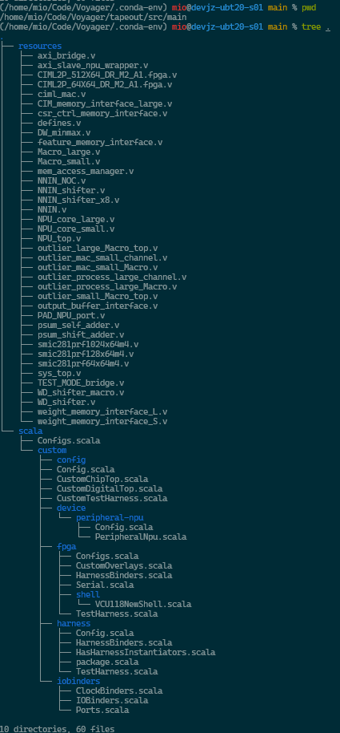
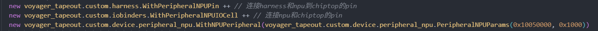

# Voyager流片平台对接文档


### 服务器账号

东南VPN网络下

ssh tyc@10.201.230.232

密码：tyctyc


**登录上后执行chipyard_exec，会启用环境变量并将你传送到流片仓库根目录**


### 工作路径



说明：

- 生成的Verilog代码中``ChipTop`` 为实际流片CPU+NPU的顶层，`` TestHarness `` 为我们进行仿真测试的顶层
- `` device/peripheral-npu`` 中定义了 npu 的顶层和并连接 resources 中具体实现的 verilog

- `` iobinders`` 中定义了 npu 的 pin脚如何拉到`` ChipTop``
- `` harness`` 中定义了 npu  的 pin脚在拉到`` TestHarness``，规定测试时的行为，否则无法构建完整比特流和跑仿真


代码阅读：可以通过搜索PeripheralNPU等字段可以查看如何将外设连到外设总线（pbus）和将pin脚拉到顶层， 具体阅读这三个 trait即可



### 环境变量设置

使用该工程需要提前执行环境变量脚本
```
chipyard_exec
```

### 代码生成

完整SOC代码生成，请使用该命令，生成的所有.v文件将存放在`` tapeout/generated-src`` 下

```
./voyager-test/scripts/build-verilator.sh --config VoyagerVerilatorConfig --project voyager_tapeout --sub-project voyager_tapeout
```

使用该命令可以通过执行等测试workload仿真，如

```
./voyager-test/scripts/run-verilator.sh --config VoyagerVerilatorConfig --debug peripheral
```

如果需要编译vcs的仿真，可执行以下命令，代码生成
```
./voyager-test/scripts/build-vcs.sh --config VoyagerVcsConfig --debug --project voyager_tapeout --sub-project voyager_tapeout
```

如果需要执行vcs的仿真，可执行以下命令，运行测试workload
```
./voyager-test/scripts/run-vcs.sh   --config VoyagerVcsConfig --debug peripheral 
```

如果需要查看生成的代码或者波形文件，在目录`` ./voyager-test/output``

若遇到vcs无法重新编译的问题，可到`` ./sims/vcs``目录执行make clean

workload书写见`` ./voyager-test/src/workloads/peripheral`` 

编译workload的操作如下：
```
cd ./voyager-test/build
make
```


实际完全流片的配置需要使用其他命令生成，该命令能跑通之后生成verilog流程正常也能跑通


### 代码更新与提交

记得定时git pull拉取总体仓库代码进行同步

如果需要更新代码到仓库，建议先pull最新代码，再在最近的代码上进行修改，后更新，执行git push更新代码到仓库

#### 尽量不要Merge！

#### 如果push的时候，和仓库的提交历史冲突

请先用`` git stash ``保存当前修改，保持一个和远程同步的历史（如果历史不同步就reset到同步的历史），pull下来

后面用`` git stash show stash@\{0\} ``查看你保存的修改，用`` git checkout stash@{0} --``选择性恢复你的修改

举例，比如我的修改是`` tapeout/src/main/scala/custom/Config.scala  tapeout/src/main/scala/custom/device/peripheral-npu/Config.scala``这两个文件，我想恢复第一个，我需要
```
git checkout stash@{0} -- tapeout/src/main/scala/custom/Config.scala

git add tapeout/src/main/scala/custom/Config.scala

git commit -m "your comment"

git push
```

后续有问题，可联系`` deanyou1224@gmail.com``


