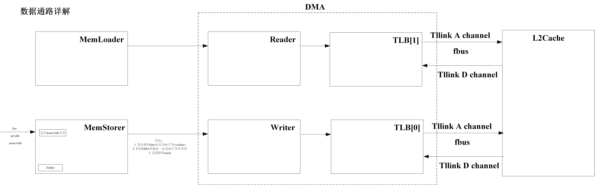
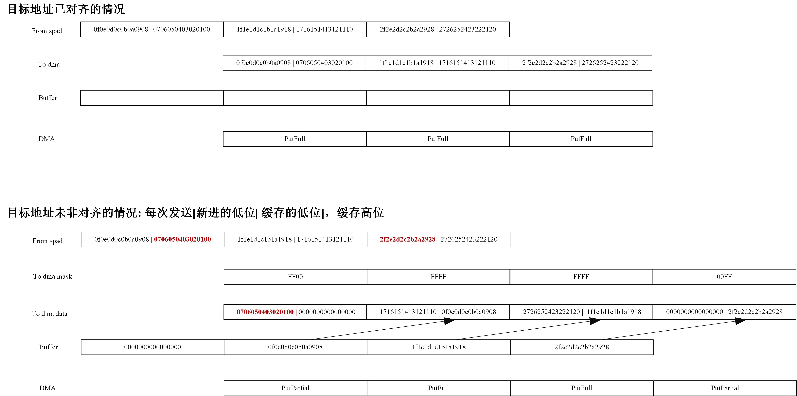

# BuckyBall


## ISA

BuckyBall加速器支持以下三条核心指令，用于数据移动和矩阵计算操作：

### MVIN - 数据移入指令 (Move In)

**功能**: 将数据从主内存加载到scratchpad内存

**func7**: `0010000` 24

**格式**: `bb_mvin rs1, rs2`

**操作数**:
- `rs1`: 主内存地址
- `rs2[addrLen-1:0]`: scratchpad地址
- `rs2[2*addrLen-1:addrLen]`: 行数(iter) 一共有多少行
- `rs2[2*addrLen+9:2*addrLen]`: 列数 最后一行有多少列（mask），其余行均与带宽对齐

**操作**: 将主内存地址`rs1`处的数据加载到scratchpad地址`rs2[addrLen-1:0]`，执行`rs2[2*addrLen+9:addrLen]`次迭代

rs1:
```
┌─────────────────────────────────────────────────────────────────┐
│                        mem_addr                                 │
│                    (memAddrLen bits)                            │
├─────────────────────────────────────────────────────────────────┤
│                    [memAddrLen-1:0]                             │
└─────────────────────────────────────────────────────────────────┘
```

rs2:
```
┌──────────────────────────────────┬──────────────────────────────────────────┐
│        row(iter)                 │                sp_addr                   │
│     (10 bits)                    │            (spAddrLen bits)              │
├──────────────────────────────────┼──────────────────────────────────────────┤
│ [spAddrLen+9: spAddrLen]         │            [spAddrLen-1:0]               │
└──────────────────────────────────┴──────────────────────────────────────────┘
```

### MVOUT - 数据移出指令 (Move Out)

**功能**: 将数据从scratchpad内存存储到主内存

**func7**: `0010001` 25

**格式**: `bb_mvout rs1, rs2`

**操作数**:
- `rs1`: 主内存地址
- `rs2[addrLen-1:0]`: scratchpad地址  
- `rs2[2*addrLen+9:addrLen]`: 搬出去多少行（迭代次数）

**操作**: 将scratchpad地址`rs2[addrLen-1:0]`处的数据存储到主内存地址`rs1`，执行`rs2[2*addrLen+9:addrLen]`次迭代

rs1:
```
┌─────────────────────────────────────────────────────────────────┐
│                        mem_addr                                 │
│                    (memAddrLen bits)                            │
├─────────────────────────────────────────────────────────────────┤
│                    [memAddrLen-1:0]                             │
└─────────────────────────────────────────────────────────────────┘
```

rs2:
```
┌──────────────────────────────────┬──────────────────────────────────────────┐
│        row(iter)                 │                sp_addr                   │
│     (10 bits)                    │            (spAddrLen bits)              │
├──────────────────────────────────┼──────────────────────────────────────────┤
│   [spAddrLen+9: spAddrLen]       │             [spAddrLen-1:0]              │
└──────────────────────────────────┴──────────────────────────────────────────┘
```

### bb_mul_warp16 - 乘法指令

**功能**: 执行16-way warp的矩阵乘法运算

**func7**: `0100000` 32

**格式**: `bb_mul_warp16 rs1, rs2`

**操作数**:
- `rs1[spAddrLen-1:0]`: 第一个操作数的scratchpad地址
- `rs1[2*spAddrLen-1:spAddrLen]`: 第二个操作数的scratchpad地址
- `rs2[spAddrLen-1:0]`: 结果写回的scratchpad地址
- `rs2[spAddrLen+9:spAddrLen]`: 迭代次数

**操作**: 从scratchpad读取两个操作数，执行矩阵乘法运算，并将结果写回到指定的scratchpad地址

rs1:
```
┌────────────────────────────────┬──────────────────────────────┐
│           op2_spaddr           │          op1_spaddr          │
│       (spAddrLen bits)         │      (spAddrLen bits)        │
├────────────────────────────────┼──────────────────────────────┤
│  [2*spAddrLen-1:spAddrLen]     │ [spAddrLen-1:0]              │
└────────────────────────────────┴──────────────────────────────┘
```

rs2:
```
┌──────────────────────────┌────────────────────────────────────┐
│         iter             │    wr_spaddr                       │
│       (10 bits)          │  (spAddrLen bits)                  │
├──────────────────────────├────────────────────────────────────┤
│ [spAddrLen+9:  spAddrLen]│  [spAddrLen-1:0]                   │
└──────────────────────────└────────────────────────────────────┘
```

### bb_transpose - 转置指令

**功能**: 在scratchpad内执行矩阵转置运算

**func7**: `0100001` 33

**格式**: `bb_transpose rs1, rs2`

**操作数**:
- `rs1[spAddrLen-1:0]`: 输入矩阵的scratchpad地址
- `rs2[spAddrLen-1:0]`: 输出矩阵的scratchpad地址  
- `rs2[spAddrLen+9:spAddrLen]`: 输出矩阵的行数（迭代次数）

**操作**: 将输入矩阵转置后存储到输出地址，转置前后由rowx16变为16xrow

rs1:
```
┌──────────────────────────────────────────┐
│            input_spaddr                  │
│            (spAddrLen bits)              │
├──────────────────────────────────────────┤
│            [spAddrLen-1:0]               │
└──────────────────────────────────────────┘
```

rs2:
```
┌──────────────────────────────┬──────────────────────────────────────────┐
│        row(iter)             │           output_spaddr                  │
│     (10 bits)                │            (spAddrLen bits)              │
├──────────────────────────────┼──────────────────────────────────────────┤
│ [spAddrLen+9: spAddrLen]     │            [spAddrLen-1:0]               │
└──────────────────────────────┴──────────────────────────────────────────┘
```


## 数据通路




约定：
1. 所有EX指令的op1和op2不能同时访问同一个bank
2. 所有指令对scratchpad的访问不能超出该bank
3. 所有bank均为单端口(同时可读可写，应该不支持读写同一个地址(未测试))
4. 目前的bank划分，scratchpad为4个bank(64KBx4)，acc为2个bank(64KBx2)
5. acc的两个bank是弹性的，当CPU需要使用spad时，会操作acc中的bank2
