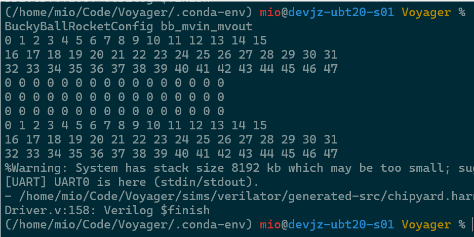
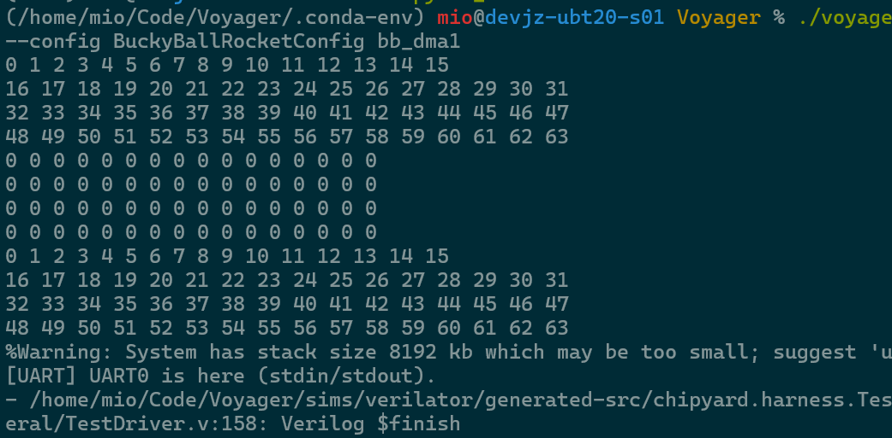
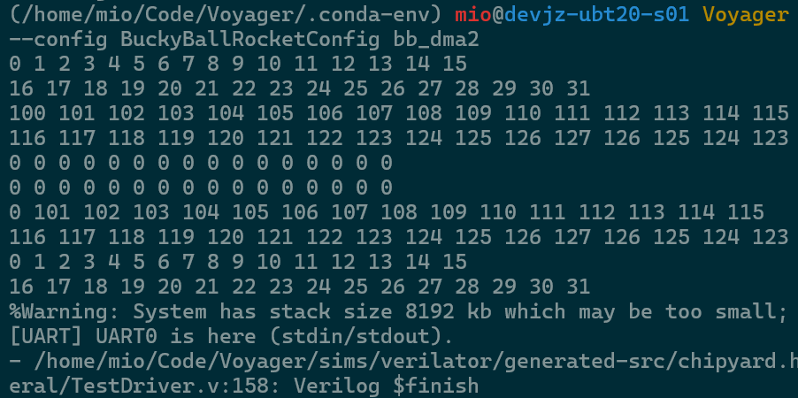
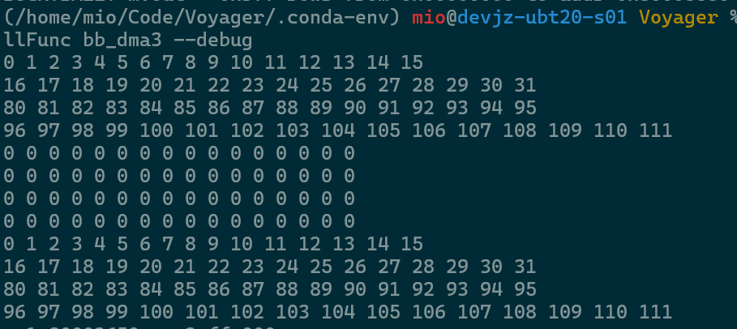

<link rel="stylesheet" type="text/css" href="styles.css">

# Buckyball Test Suite

该测试集用于验证Buckyball的正确性。<span class="red">未经测试的代码都是错误的代码</span>，再怎么强调验证的重要性都不为过。测试集中所有测试用例都可以通过spike和verilator进行验证。验证流程如下：
1. 使用buddy-mlir书写测试用例，编译生成可执行文件
2. 使用spike运行可执行文件，将workload与spike对齐
3. 使用verilator运行可执行文件，将RTL与预期结果对齐


## OpTest

<table>
<tr>
    <th>测试文件</th><th>测试目的</th><th>测试步骤</th><th>预期结果</th><th>Pass示例</th>
</tr>
<tr>
    <td><a href="OpTest/bb_mvin_mvout.mlir">bb_mvin_mvout</a></td>
    <td>验证mvin和mvout指令的正确性</td>
    <td>
        1. 打印输入矩阵 <br>
        2. <span class="blue">[CHECK1]</span> 打印搬移前目标地址的矩阵 <br>
        3. 使用mvin将数据从内存搬到暂存器 <br>
        4. 使用mvout将数据从暂存器搬回输出内存 <br>
        5. <span class="blue">[CHECK2]</span> 打印搬移后目标地址的矩阵  <br>
    </td>
    <td>
        <span class="blue">[CHECK1]</span> 打印结果应为全0矩阵 <br>
        <span class="blue">[CHECK2]</span> 打印结果应该与输入矩阵相同 <br>
    </td>
    <td>
        
    </td>
</tr>
<tr>
    <td><a href="OpTest/bb_dma1.mlir">bb_dma1</a></td>
    <td>验证mvin/mvout模块面对16字节对齐地址时的正确性</td>
    <td>
        1. 打印输入矩阵 <br>
        2. <span class="blue">[CHECK1]</span> 打印搬移前目标地址的矩阵 <br>
        3. 使用mvin将数据从16字节对齐的源地址搬到暂存器 <br>
        4. 使用mvout将数据从暂存器搬到16字节对齐的目标地址 <br>
        5. <span class="blue">[CHECK2]</span> 打印搬移后目标地址的矩阵 <br>
    </td>
    <td>
        <span class="blue">[CHECK1]</span> 打印结果应为全0矩阵 <br>
        <span class="blue">[CHECK2]</span> 打印结果应该与输入矩阵相同 <br>
    </td>
    <td>
        
    </td>
</tr>
<tr>
    <td><a href="OpTest/bb_dma2.mlir">bb_dma2</a></td>
    <td>验证mvin/mvout模块快速交替读写的正确性</td>
    <td>
        1. 打印输入矩阵A和B <br>
        2. <span class="blue">[CHECK1]</span> 打印搬移前临时矩阵 <br>
        3. 执行快速交替操作：逐步使用mvin读取，mvout写入 <br>
        4. <span class="blue">[CHECK2]</span> 打印交换后的矩阵A和B <br>
        5. 验证高频mvin/mvout操作的稳定性 <br>
    </td>
    <td>
        <span class="blue">[CHECK1]</span> 打印结果应为全0矩阵 <br>
        <span class="blue">[CHECK2]</span> 打印结果应该显示A和B内容交换 <br>
    </td>
    <td>
        
    </td>
</tr>
<tr>
    <td><a href="OpTest/bb_dma3.mlir">bb_dma3</a> <br> 
        <span class="purple">[耗时较长]</span><br>
        <span class="yellow">[需要fence]</span>
    </td>
    <td>验证mvin/mvout模块长读入读出的正确性</td>
    <td>
        1. 动态生成1024x16大型输入矩阵，数据0~127反复填入 <br>
        2. <span class="blue">[CHECK1]</span> 打印搬移前目标地址的矩阵 <br>
        3. 使用mvin将大数据量(1024x16)从内存读入暂存器 <br>
        4. 使用mvout将大数据量从暂存器写出到内存 <br>
        5. <span class="blue">[CHECK2]</span> 打印搬移后目标地址的矩阵 <br>
    </td>
    <td>
        <span class="blue">[CHECK1]</span> 打印结果应为全0矩阵 <br>
        <span class="blue">[CHECK2]</span> 打印结果应该与输入矩阵相同 <br>
    </td>
    <td>
        
    </td>
</tr>

</table>

---
## CTest
<table>
<tr>
    <th>测试文件</th><th>测试目的</th><th>测试步骤</th>
</tr>
<tr>
    <td><a href="CTest/mvin_mvout.c">ctest_mvin_mvout</a></td>
    <td>验证mvin和mvout指令的正确性</td>
    <td>
        1. 打印输入矩阵 <br>
        2. 打印搬移前目标地址的矩阵 <br>
        3. 使用mvin将数据从内存搬到暂存器 <br>
        4. 使用mvout将数据从暂存器搬回输出内存 <br>
        5. 打印搬移后目标地址的矩阵  <br>
    </td>
</tr>
<tr>
    <td><a href="CTest/vecunit_matmul.c">ctest_vecunit_matmul</a></td>
    <td>使用VecUnit进行矩阵乘法</td>
    <td>
        1. 使用mvin将数据从内存搬到暂存器 <br>
        2. 使用VecUnit进行矩阵乘法<br>
        3. 使用mvout将数据从暂存器搬回输出内存 <br>
    </td>
</tr>
</table>

运行CTest目录下的测试代码时，请参考以下Linux命令：
```
./voyager-test/scripts/run-verilator.sh --debug --config BuckyBallRocketConfig ctest_vecunit_matmul
```
其中ctest_vecunit_matmul是 voyager-test/output/workloads/npu/buckyball/CTest目录下的bin文件名

---
## 测试用例模板

添加新测试用例时，复制以下模板并竖向编辑：

```html
<tr>
    <td><a href="OpTest/新测试文件.mlir">新测试名</a></td>
    <td>
        新测试的目的描述
    </td>
    <td>
        1. 第一步<br>
        2. 第二步<br>
        3. 第三步
    </td>
    <td>
        预期的测试结果
    </td>
    <td>
        
    </td>
</tr>
```

## 尚未解决的bug
- [bb_dma2](Optest/bb_dma2.mlir) 非对齐写入还是有bug，当写入的目标mem地址不是16字节对齐时，移除 {aligment = 16} 会报 dma 请求地址不对齐。在bb_mvin_mvout的简单测试中，没有 {aligment = 16} 后，打印结果是正确的。目前看来带上对齐就没事，不带还是有概率出事。

> **PS**: 本文档使用了自定义样式进行颜色标记。在GitHub等不支持内联CSS的环境中，颜色标记可能无法正常显示。